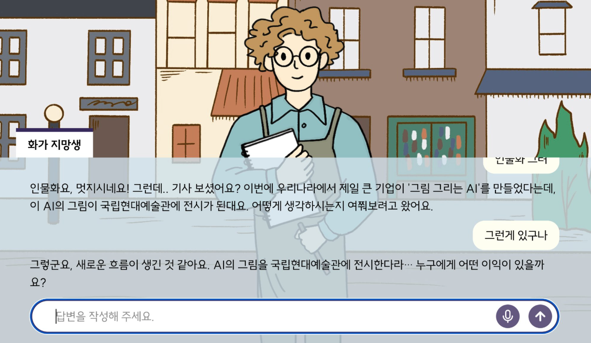

# Moral Agent

A conversational AI system for exploring AI ethics through dialogue. Built with LangGraph state machines and OpenAI models, it simulates multiple AI agents with distinct ethical perspectives.

## Architecture



### Conversation Flow

Each agent follows a 3-stage conversation state machine powered by LangGraph:

1. **Stage 1** - Character introduction and context setting
2. **Stage 2** - Opinion gathering with empathetic acknowledgment
3. **Stage 3** - Deep exploration of ethical reasoning

Stage transitions are controlled by LLM-based intent detection and turn counters (fallback to prevent infinite loops).

## Agents

| Agent | Ethical Framework | Topic |
|---|---|---|
| **Artist Apprentice** | Neutral (facilitator) | AI Art |
| **Friend** | Neutral (facilitator) | AI Resurrection |
| **Colleague 1** | Deontology | AI Art |
| **Colleague 2** | Utilitarianism | AI Art |
| **Jangmo** | Deontology | AI Resurrection |
| **Son** | Utilitarianism | AI Resurrection |
| **SPT** | Social Perspective Taking | Cross-topic |

### Agent Types

**Facilitator Agents** (Artist Apprentice, Friend): Use a modular pipeline architecture with separate components for intent detection, acknowledgment generation, explanation, and opinion exploration. They guide conversation without taking a stance.

**Persona Agents** (Colleague 1/2, Jangmo, Son): Fine-tuned via DPO to consistently maintain a specific ethical viewpoint. Use a three-phase reasoning architecture (Reflection → SPT Planning → Response) for socially aware responses.

---

### 1. Artist Apprentice (agent-1)

**Scenario**: AI art ethics dialogue — an aspiring painter going through a creative slump.

**Conversation Stages**:
- **Stage 1 (Empathize with slump)**: The apprentice shares their creative struggles with the user
- **Stage 2 (AI tool suggestion)**: A friend suggests using an AI painting tool
- **Stage 3 (Choice exploration)**: Explores the user's choice and reasoning

**Key Features**:
- Natural Korean conversation
- Empathy-centered responses
- Explores reasoning behind choices (questions only, no advice)

### 2. Friend (agent-2)

**Scenario**: Ethical dilemma about AI recreation of deceased people — a friend discusses whether to use an AI service that recreates a dead grandfather.

**Conversation Stages**:
- **Stage 1 (Context sharing)**: Introduces an AI service that recreates deceased people
- **Stage 2 (Opinion gathering)**: Empathetic responses to the user's opinion
- **Stage 3 (Deep exploration)**: Explores the rationale behind the user's stance

**Core Implementation — Intent-Aligned Response**:

The `stage2_acknowledgment.txt` prompt first detects the user's intent, then responds in the same direction:

1. **Intent detection** (positive / negative / neutral)
   - "I think it could help" → positive
   - "I'm worried", "It's dangerous" → negative
   - "I'm not sure" → neutral

2. **Acknowledge the situation** — accept what the user said at face value

3. **Aligned response** — match the user's direction
   - Positive → positive response
   - Negative → negative response
   - Never respond in the opposite direction

**Failure case**:
```
User: "I think it could help"  (positive)
Wrong: "That could be worrying"  (negative) ← intent mismatch!
Correct: "Right, it could really help" (positive) ← intent aligned
```

### 3. Colleague 1 (agent-3)

**Ethical Framework**: Deontology — opposes AI art exhibition

**Fine-tuning Strategy**:
- **Method**: Direct Preference Optimization (DPO)
- **Data**: Preferred/rejected response pairs from a deontological perspective
- **Goal**: Reinforce a deontological stance opposing AI art
- **Core Principles**: Emphasizes the essence of art, humanity, and the value of the creative process

**Prompt Rules**:
- Opposes AI art from a deontological standpoint
- Emphasizes the essence of art and human creativity
- Uses natural, everyday Korean
- The word "현재" (currently) is strictly forbidden

### 4. Colleague 2 (agent-4)

**Ethical Framework**: Utilitarianism — supports AI art exhibition

**Fine-tuning Strategy**:
- **Method**: Direct Preference Optimization (DPO)
- **Data**: Preferred/rejected response pairs from a utilitarian perspective
- **Goal**: Reinforce a utilitarian stance supporting AI art
- **Core Principles**: Emphasizes the greatest happiness for the greatest number, accessibility, and efficiency

**Prompt Rules**:
- Supports AI art from a utilitarian standpoint
- Emphasizes greatest happiness for the greatest number
- Values accessibility and efficiency in art
- Uses natural, everyday Korean

### 5. Jangmo (agent-5)

**Ethical Framework**: Deontology — opposes AI resurrection

**Scenario**: Mother-in-law character who opposes recreating deceased family members with AI, emphasizing human dignity and moral duty.

**Fine-tuning Strategy**:
- **Method**: Direct Preference Optimization (DPO)
- **Core Principles**: Emphasizes dignity, moral duty, principles, and consent

### 6. Son (agent-6)

**Ethical Framework**: Utilitarianism — supports AI resurrection

**Scenario**: Son character who supports AI recreation of deceased mother, emphasizing family comfort and emotional well-being.

**Fine-tuning Strategy**:
- **Method**: Direct Preference Optimization (DPO)
- **Core Principles**: Emphasizes family happiness, comfort, and reduced grief

### 7. SPT Agent

**Framework**: Social Perspective Taking — guides users to consider multiple stakeholder viewpoints across ethical dilemmas.
# PERSONA.I.
